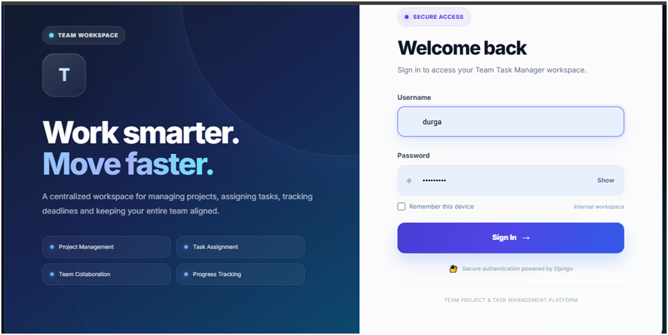
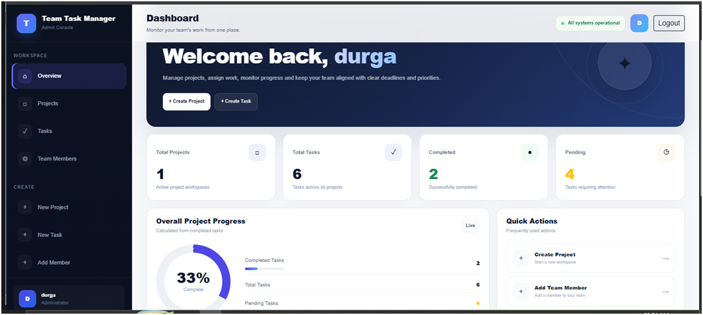

# Team Task Management System

A modern **Server-Side Rendered (SSR) Team Task Management System** built with **Python and Django**.

The application allows administrators to manage projects, team members, and tasks, while team members can view their assigned tasks, update task status, and add progress updates.



## 🚀 Project Overview

Team Task Management is an internal workspace designed to help teams organize their daily project work efficiently.

The application provides role-based access for:

* **Admin**
* **Team Member**




Admins can create projects, manage team members, assign tasks, set priorities and deadlines, and monitor overall progress.

Team members can view their assigned tasks, update task status, and add progress comments.

---

## ✨ Features

### 👨‍💼 Admin

* Secure admin login
* Admin dashboard
* Create projects
* Edit projects
* Delete projects
* View project progress
* Add team members
* Manage team members
* Create tasks
* Edit tasks
* Assign tasks to team members
* Set task priority
* Set task status
* Set task deadlines
* Search tasks
* Filter tasks by:

  * Project
  * Team member
  * Priority
  * Status
* View task details
* Track completed and pending tasks
* Track overall project progress
* Maintain deadline history

### 👨‍💻 Team Member

* Secure team member login
* Team member dashboard
* View assigned tasks
* View task details
* Update task status
* Add progress comments
* Track project and task deadlines

---

## 🎯 User Roles

| Role        | Access                                        |
| ----------- | --------------------------------------------- |
| Admin       | Full project, team member and task management |
| Team Member | View assigned tasks and update progress       |

---

## 🏗️ Technology Stack

### Backend

* Python
* Django
* Django ORM
* Django Authentication
* SQLite

### Frontend

* HTML5
* CSS3
* Bootstrap 5
* JavaScript
* Google Fonts

### Architecture

* Server-Side Rendering (SSR)
* Django Templates
* Role-Based Access Control
* MVC/MVT architecture

---

## 📂 Project Structure


team-task-manager/
│
├── config/
│   ├── settings.py
│   ├── urls.py
│   └── wsgi.py
│
├── accounts/
│   ├── migrations/
│   ├── templates/
│   │   └── accounts/
│   │       ├── login.html
│   │       ├── admin_dashboard.html
│   │       ├── member_dashboard.html
│   │       ├── add_team_member.html
│   │       └── team_members.html
│   │
│   ├── forms.py
│   ├── models.py
│   ├── urls.py
│   └── views.py
│
├── projects/
│   ├── migrations/
│   ├── templates/
│   │   └── projects/
│   │       ├── project_list.html
│   │       ├── project_form.html
│   │       └── project_confirm_delete.html
│   │
│   ├── forms.py
│   ├── models.py
│   ├── urls.py
│   └── views.py
│
├── tasks/
│   ├── migrations/
│   ├── templates/
│   │   └── tasks/
│   │       ├── task_list.html
│   │       ├── task_form.html
│   │       ├── my_tasks.html
│   │       └── task_detail.html
│   │
│   ├── forms.py
│   ├── models.py
│   ├── urls.py
│   └── views.py
│
├── templates/
│
├── db.sqlite3
│
├── manage.py
│
└── requirements.txt


---

## 🗄️ Main Data Models

### User

Stores application users and their roles.


User
├── username
├── email
├── password
└── role
    ├── ADMIN
    └── TEAM_MEMBER


### Project

Stores project information.


Project
├── name
├── description
├── start_date
└── end_date


### Task

Stores task information.


Task
├── project
├── title
├── description
├── assigned_to
├── priority
├── status
└── deadline


### Deadline History

Tracks deadline changes made to existing tasks.


DeadlineHistory
├── task
├── old_deadline
├── new_deadline
└── changed_by


### Task Comment

Stores team member progress updates.


TaskComment
├── task
├── user
└── comment


---

## 🔐 Authentication & Authorization

The project uses Django authentication for secure login.

After successful login, users are redirected based on their role:


Admin
   ↓
Admin Dashboard

Team Member
   ↓
Team Member Dashboard


Unauthorized users are redirected away from restricted pages.

---

## 📊 Dashboard

### Admin Dashboard

The admin dashboard provides:

* Total projects
* Total tasks
* Completed tasks
* Pending tasks
* Overall completion percentage
* Project management
* Team member management
* Task management
* Quick actions

### Team Member Dashboard

The team member dashboard provides:

* Assigned task access
* Task progress workflow
* Status updates
* Progress comments

---

## 🔄 Task Workflow


Create Task
     ↓
Assign Team Member
     ↓
Set Priority
     ↓
Set Deadline
     ↓
To Do
     ↓
In Progress
     ↓
Completed


---

## 🔎 Task Search & Filtering

Admins can quickly find tasks using:


Search
   +
Project
   +
Assigned Member
   +
Priority
   +
Status


This makes task management easier when the number of tasks increases.

---

## 🎨 UI / UX

The interface is designed with a modern enterprise SaaS style.

Highlights include:

* Responsive layouts
* Professional typography
* Modern dashboard cards
* Sidebar navigation
* Top navigation bar
* Animated login interface
* Progress indicators
* Status badges
* Responsive tables
* Form validation states
* Password visibility toggle
* Mobile-friendly layouts

---

## ⚙️ Installation

### 1. Clone the repository


git clone https://github.com/your-username/team-task-manager.git


### 2. Open the project


cd team-task-manager


### 3. Create a virtual environment

Windows:


python -m venv venv


Activate:


venv\Scripts\activate


### 4. Install dependencies


pip install -r requirements.txt


### 5. Run migrations


python manage.py makemigrations
python manage.py migrate


### 6. Create an admin/superuser

python manage.py createsuperuser


### 7. Run the development server


python manage.py runserver


Open:


http://127.0.0.1:8000/
```

---

## 🔑 Application Flow


Login
  │
  ├── Admin
  │     └── Admin Dashboard
  │           ├── Projects
  │           ├── Team Members
  │           └── Tasks
  │
  └── Team Member
        └── Member Dashboard
              └── My Tasks
                    ├── Update Status
                    └── Add Progress


---

## 🧪 Testing

Run Django system checks:


python manage.py check


Run tests:


python manage.py test
```

---

## 🔒 Security Considerations

The project uses Django's built-in security features including:

* CSRF protection
* Password hashing
* Session authentication
* Login-required views
* Role-based authorization
* Django ORM
* Server-side form validation


## 🌱 Future Improvements

Potential future enhancements include:

* REST API integration
* Email notifications
* Task attachments
* Real-time notifications
* Advanced analytics
* Project activity timeline
* Pagination
* PostgreSQL support
* Cloud deployment
* Docker support
* Automated testing and CI/CD


## 📌 Project Type

**Full Stack Web Application**

**Architecture:** Server-Side Rendering (SSR)

**Domain:** Project & Task Management

**Authentication:** Role-Based Authentication

**Database:** SQLite


## 👩‍💻 Author

**R. Durga Devi**

Python Full Stack Developer

Technologies:


Python
Django
HTML
CSS
JavaScript
Bootstrap
SQLite
Git
GitHub


---

## ⭐ Project Goal

The goal of this project is to build a practical enterprise-style team workspace where administrators can manage projects and tasks while team members can collaborate through task updates and progress tracking.

---

## 📄 License

This project is developed for educational, portfolio and demonstration purposes.


## API Documentation / Available Endpoints

### Authentication & Account Endpoints

| Method     | Endpoint                      | Description                                   |
| ---------- | ----------------------------- | --------------------------------------------- |
| GET / POST | `/accounts/login/`            | User login                                    |
| GET        | `/accounts/logout/`           | Logout the current user                       |
| GET        | `/accounts/dashboard/`        | Redirect/display dashboard based on user role |
| GET        | `/accounts/admin-dashboard/`  | Admin dashboard                               |
| GET        | `/accounts/member-dashboard/` | Team Member dashboard                         |
| GET        | `/accounts/team-members/`     | View team members                             |
| GET / POST | `/accounts/team-members/add/` | Add a new team member                         |

### Project Endpoints

| Method     | Endpoint                 | Description              |
| ---------- | ------------------------ | ------------------------ |
| GET        | `/projects/`             | View all projects        |
| GET / POST | `/projects/create/`      | Create a new project     |
| GET / POST | `/projects/<id>/edit/`   | Edit an existing project |
| POST       | `/projects/<id>/delete/` | Delete a project         |

### Task Endpoints

| Method     | Endpoint               | Description                                      |
| ---------- | ---------------------- | ------------------------------------------------ |
| GET        | `/tasks/`              | View all tasks                                   |
| GET / POST | `/tasks/create/`       | Create a new task                                |
| GET        | `/tasks/my-tasks/`     | View tasks assigned to the logged-in team member |
| GET        | `/tasks/<id>/`         | View task details                                |
| GET / POST | `/tasks/<id>/edit/`    | Edit an existing task                            |
| POST       | `/tasks/<id>/status/`  | Update task status                               |
| GET / POST | `/tasks/<id>/comment/` | Add a comment to a task                          |

### User Roles

* **Admin**

  * Create and manage projects
  * Add team members
  * Create and assign tasks
  * Edit and delete projects
  * View project and task information

* **Team Member**

  * View assigned tasks
  * View task details
  * Update task status
  * Add comments to tasks

### Example URLs

Local development:


http://127.0.0.1:8000/accounts/login/
http://127.0.0.1:8000/accounts/dashboard/
http://127.0.0.1:8000/projects/
http://127.0.0.1:8000/tasks/
http://127.0.0.1:8000/tasks/my-tasks/


## Requirements Implemented

* **Authentication**

  * Implemented user login and logout using Django authentication.
  * Protected pages require user authentication.

* **Role-Based Access Control**

  * Implemented two roles: **Admin** and **Team Member**.
  * Admin users can manage projects, team members, and tasks.
  * Team Members can view assigned tasks, update task status, and add comments.

* **Database**

  * Used **SQLite** database for storing users, projects, tasks, and related information.
  * Django ORM is used for database operations.

* **Frontend & Backend Integration**

  * Built the frontend using Django Templates, HTML, CSS, and Bootstrap.
  * Backend functionality is implemented using Django views, models, forms, and URL routing.
  * Frontend forms are connected to backend views and database operations.

* **Form Validation**

  * Implemented Django form validation for user and project/task-related forms.
  * Required fields and invalid inputs are handled before saving data.

* **Error Handling**

  * Handles authentication errors, invalid form submissions, missing records, and unauthorized access.
  * Uses Django messages and appropriate redirects to provide user feedback.

* **Clean and Organized Code**

  * Project is separated into Django applications:

    * `accounts` – authentication and user management
    * `projects` – project management
    * `tasks` – task management
  * Uses Django's MVC/MVT architecture with organized models, views, forms, templates, and URL configurations.


Optional Enhancements / Future Enhancements

Email notifications — Planned for future implementation
Task activity history — Planned
Search and filters — Planned
File attachments — Planned
Docker setup — Planned
Automated tests — Planned


## Submission Guidelines

* The GitHub repository contains the complete source code of the project.
* The repository is publicly accessible for evaluation.
* The README includes clear installation and setup instructions.
* Database configuration and migration instructions are provided.
* API endpoints and project features are documented.
* The ER diagram/database schema is included in the repository.
* Local development instructions are provided to run the project successfully.
* A live deployment link will be added after deployment, if available.
